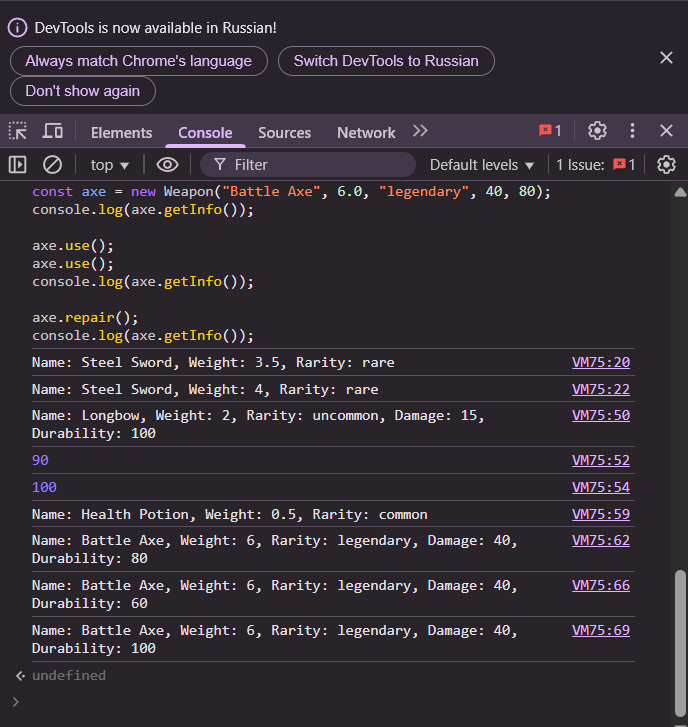

# Лабораторная работа №3. Продвинутые объекты в JavaScript

## Цель работы
Познакомиться с классами и объектами в JavaScript, научиться создавать классы, использовать конструкторы и методы, а также реализовать наследование.

## Условие
Создайте консольное приложение, моделирующее систему инвентаря, где можно добавлять предметы, изменять их свойства и управлять ими.

---

## Шаг 1. Создание класса Item

Класс `Item` представляет предмет в инвентаре.

### Поля класса:
- `name` – название предмета.
- `weight` – вес предмета.
- `rarity` – редкость предмета (`common`, `uncommon`, `rare`, `legendary`).

### Методы:
- `getInfo()` – возвращает строку с информацией о предмете.
- `setWeight(newWeight)` – изменяет вес предмета.

### Пример кода:
```javascript
// === Шаг 1. Класс Item ===
class Item {
  constructor(name, weight, rarity) {
    this.name = name;
    this.weight = weight;
    this.rarity = rarity;
  }

  getInfo() {
    return `Name: ${this.name}, Weight: ${this.weight}kg, Rarity: ${this.rarity}`;
  }

  setWeight(newWeight) {
    this.weight = newWeight;
  }
}

// Пример использования
const sword = new Item("Steel Sword", 3.5, "rare");
console.log(sword.getInfo());
sword.setWeight(4.0);
console.log(sword.getInfo());
```

---

## Шаг 2. Создание класса Weapon

Класс `Weapon` расширяет `Item`.

### Дополнительные поля:
- `damage` – урон оружия.
- `durability` – прочность (от 0 до 100).

### Методы:
- `use()` – уменьшает `durability` на 10 (если `durability > 0`).
- `repair()` – восстанавливает `durability` до 100.

### Пример кода:
```javascript
// === Шаг 2. Класс Weapon ===
class Weapon extends Item {
  constructor(name, weight, rarity, damage, durability) {
    super(name, weight, rarity);
    this.damage = damage;
    this.durability = durability;
  }

  use() {
    if (this.durability > 0) {
      this.durability -= 10;
      console.log(`${this.name} used. Durability: ${this.durability}`);
    } else {
      console.log(`${this.name} is broken.`);
    }
  }

  repair() {
    this.durability = 100;
    console.log(`${this.name} has been repaired.`);
  }

  getInfo() {
    return super.getInfo() + `, Damage: ${this.damage}, Durability: ${this.durability}`;
  }
}

// Пример использования
const bow = new Weapon("Longbow", 2.0, "uncommon", 15, 100);
console.log(bow.getInfo());
bow.use();
console.log("Durability after use:", bow.durability);
bow.repair();
console.log("Durability after repair:", bow.durability);
```

---

## Шаг 3. Тестирование

Создание и тестирование объектов классов `Item` и `Weapon`.

### Пример кода:
```javascript
// === Шаг 3. Тестирование ===
const potion = new Item("Health Potion", 0.5, "common");
const axe = new Weapon("Battle Axe", 5.0, "legendary", 25, 80);

console.log(potion.getInfo());
potion.setWeight(0.6);
console.log(potion.getInfo());

console.log(axe.getInfo());
axe.use();
axe.use();
axe.repair();
console.log(axe.getInfo());
```

---
## Вызов в консоль 


## Заключение

В ходе лабораторной работы №3 были изучены и реализованы основные принципы объектно-ориентированного программирования в JavaScript:

- Создание классов с полями и методами.
- Использование функций-конструкторов.
- Реализация наследования через ключевое слово `extends`.
- Расширение и переопределение методов в дочерних классах.

Результатом стал функциональный прототип системы инвентаря, включающий возможность создания, редактирования и управления предметами и оружием.