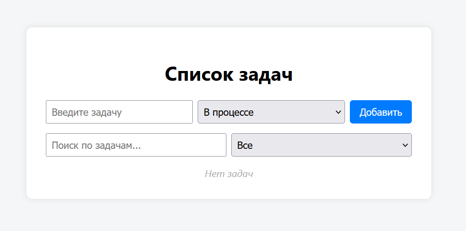
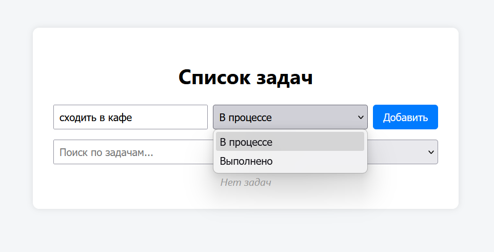
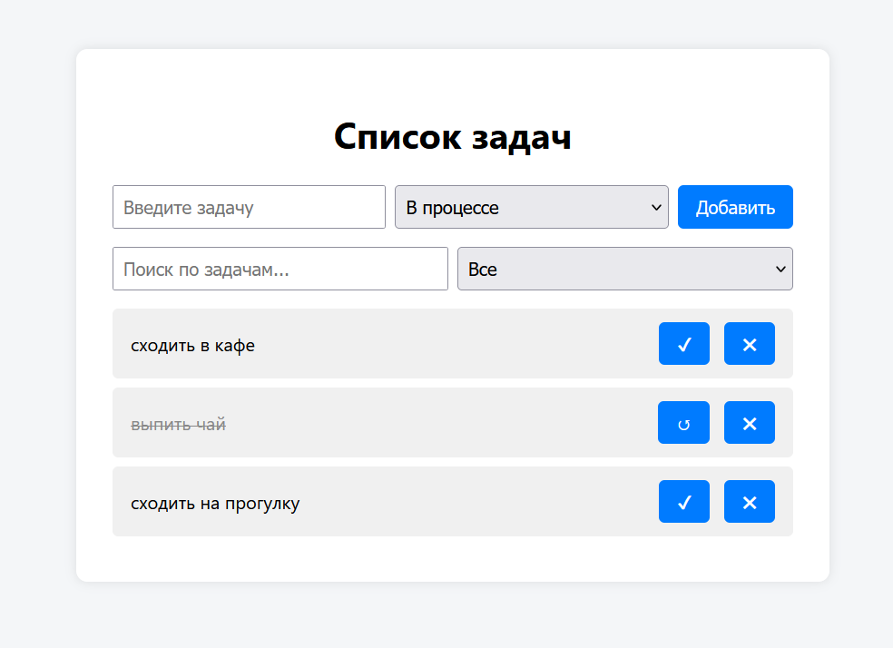
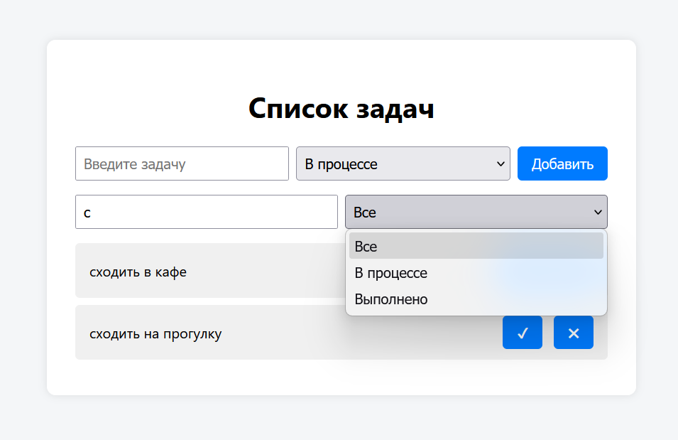

# ToDo List — Индивидуальный Проект

##  Описание проекта

**ToDo List** — это веб-приложение для создания, управления и фильтрации задач.
**Цель проекта** — разработать удобный и адаптивный интерфейс, позволяющий пользователю эффективно управлять своими делами с помощью технологии JavaScript и локального хранилища браузера (LocalStorage).

Проект написан на **HTML**, **CSS**, **Vanilla JavaScript (ES6+ модульная архитектура)**. Не используются сторонние библиотеки, что подчеркивает владение базовыми технологиями веб-разработки.

---

##  Функциональность

- Добавление задач с выбором статуса.
- Сохранение задач в LocalStorage.
- Переключение статуса задачи (в процессе / выполнено).
- Удаление задач.
- Поиск задач по ключевым словам.
- Фильтрация по статусу (все, в процессе, выполнено).
- Отображение при отсутствии задач.

---

##  Структура проекта

```
TODOPROJECT/
├── index.html
├── style.css
├── main.js
├── taskManager.js
└── ui.js
```

---

##  Автор проекта

- **Scripnic Xenia** — Группа IA2404, Университет USM

---


##  Примеры кода

###  HTML — Основной интерфейс:

```html
<!DOCTYPE html>
<html lang="ru">
<head>
  <meta charset="UTF-8" />
  <meta name="viewport" content="width=device-width, initial-scale=1.0" />
  <title>To-Do List</title>
  <!-- Подключение внешнего CSS-файла для стилизации -->
  <link rel="stylesheet" href="style.css" />
</head>
<body>
  <div class="container">
    <!-- Заголовок приложения -->
    <h1>Список задач</h1>

    <!-- Форма для добавления новой задачи -->
    <form id="task-form">
      <!-- Поле для ввода текста задачи -->
      <input type="text" id="task-input" placeholder="Введите задачу" required />
      
      <!-- Выпадающий список для выбора статуса задачи -->
      <select id="task-status">
        <option value="в процессе">В процессе</option>
        <option value="выполнено">Выполнено</option>
      </select>

      <!-- Кнопка добавления задачи -->
      <button type="submit">Добавить</button>
    </form>

    <!-- Форма фильтрации задач -->
    <div class="filters">
      <!-- Поле поиска задач по тексту -->
      <input type="text" id="search" placeholder="Поиск по задачам..." />

      <!-- Фильтр по статусу задачи -->
      <select id="filter-status">
        <option value="все">Все</option>
        <option value="в процессе">В процессе</option>
        <option value="выполнено">Выполнено</option>
      </select>
    </div>

    <!-- Список, в котором будут отображаться задачи -->
    <ul id="task-list"></ul>
  </div>

  <!-- Подключение основного JavaScript-файла с логикой приложения -->
  <script type="module" src="main.js"></script>
</body>
</html>

```

---

###  CSS — Стиль карточек задач:

```css
/* Общие стили для body */
body {
  font-family: 'Segoe UI', sans-serif; /* Шрифт по умолчанию */
  background: #f4f6f8; /* Светло-серый фон страницы */
  margin: 0;
  padding: 0;
  display: flex; /* Центрируем содержимое по горизонтали */
  justify-content: center;
  align-items: flex-start; /* Прижимаем контент к верху */
  min-height: 100vh; /* Минимальная высота — весь экран */
}

/* Контейнер основного содержимого */
.container {
  background: #fff; /* Белый фон */
  padding: 2rem; /* Внутренние отступы */
  margin-top: 3rem; /* Отступ сверху */
  border-radius: 10px; /* Скруглённые углы */
  box-shadow: 0 0 10px rgba(0,0,0,0.1); /* Мягкая тень */
  width: 100%;
  max-width: 600px; /* Максимальная ширина контейнера */
}

/* Заголовок */
h1 {
  text-align: center;
  margin-bottom: 1.5rem; /* Отступ снизу */
}

/* Стили формы и панели фильтрации */
form,
.filters {
  display: flex;
  gap: 0.5rem; /* Расстояние между элементами */
  margin-bottom: 1rem; /* Отступ снизу */
}

/* Стили для текстовых полей и select */
input[type="text"],
select {
  flex: 1; /* Растягиваются на доступную ширину */
  padding: 0.5rem;
  font-size: 1rem;
}

/* Стили кнопки */
button {
  padding: 0.5rem 1rem;
  font-size: 1rem;
  background: #007bff; /* Синий фон */
  color: #fff; /* Белый текст */
  border: none;
  border-radius: 5px;
  cursor: pointer;
}

/* Эффект при наведении на кнопку */
button:hover {
  background: #0056b3; /* Более тёмный синий */
}

/* Список задач */
ul#task-list {
  list-style: none; /* Убираем маркеры */
  padding: 0;
  margin: 0;
}

/* Оформление отдельной задачи */
.task {
  display: flex;
  justify-content: space-between; /* Элементы по краям */
  align-items: center;
  background: #f0f0f0;
  margin-bottom: 0.5rem;
  padding: 0.75rem 1rem;
  border-radius: 5px;
}

/* Стили кнопок внутри задачи */
.task .actions button {
  margin-left: 0.5rem; /* Отступ между кнопками */
}

/* Стиль для выполненной задачи */
.task.выполнено span {
  text-decoration: line-through; /* Зачёркнутый текст */
  color: #888; /* Серый цвет текста */
}

/* Стиль для текста "Нет задач" */
.empty {
  text-align: center;
  color: #aaa;
  font-style: italic;
}

```

---

###  JavaScript (main.js) — Обработка событий:

```javascript
// Импорт класса TaskManager для управления задачами
import { TaskManager } from './taskManager.js';

// Импорт функции renderTasks для отображения задач в интерфейсе
import { renderTasks } from './ui.js';

// Получение элементов формы и фильтров из DOM
const form = document.getElementById('task-form'); // Форма добавления задач
const taskInput = document.getElementById('task-input'); // Поле ввода текста задачи
const taskStatus = document.getElementById('task-status'); // Выпадающий список статуса задачи
const searchInput = document.getElementById('search'); // Поле поиска по задачам
const filterStatus = document.getElementById('filter-status'); // Фильтр по статусу

// Создание экземпляра менеджера задач
const manager = new TaskManager();

/**
 * Обновляет интерфейс в соответствии с текущим состоянием:
 * - применяет фильтр по тексту поиска
 * - применяет фильтр по статусу
 * - вызывает отрисовку задач
 */
function updateUI() {
  const search = searchInput.value.toLowerCase(); // Получаем текст поиска в нижнем регистре
  const status = filterStatus.value; // Получаем выбранный статус фильтра
  const filtered = manager.getFilteredTasks(search, status); // Получаем отфильтрованные задачи
  renderTasks(filtered, manager); // Отображаем задачи на странице
}

// Обработчик события отправки формы
form.addEventListener('submit', (e) => {
  e.preventDefault(); // Предотвращаем перезагрузку страницы
  const title = taskInput.value.trim(); // Получаем и обрезаем текст задачи
  const status = taskStatus.value; // Получаем выбранный статус

  if (title) {
    manager.addTask(title, status); // Добавляем задачу через менеджер
    taskInput.value = ''; // Очищаем поле ввода
    updateUI(); // Обновляем интерфейс
  }
});

// Обработчик ввода текста в поле поиска
searchInput.addEventListener('input', updateUI);

// Обработчик изменения фильтра по статусу
filterStatus.addEventListener('change', updateUI);

// Первичная инициализация интерфейса при загрузке страницы
updateUI();

```

---

###  Логика TaskManager (taskManager.js):

```javascript
// Экспортируем класс TaskManager, который управляет списком задач
export class TaskManager {
  constructor() {
    // При создании объекта загружаем задачи из localStorage, если они есть
    this.tasks = JSON.parse(localStorage.getItem('tasks')) || [];
  }

  // Метод для сохранения текущего списка задач в localStorage
  save() {
    localStorage.setItem('tasks', JSON.stringify(this.tasks));
  }

  /**
   * Метод для добавления новой задачи
   * @param {string} title - Название задачи
   * @param {string} status - Статус задачи ("в процессе" или "выполнено")
   */
  addTask(title, status) {
    const newTask = {
      id: Date.now().toString(), // Уникальный идентификатор задачи на основе времени
      title,
      status
    };
    this.tasks.push(newTask); // Добавляем задачу в массив
    this.save(); // Сохраняем обновлённый список
  }

  /**
   * Метод для удаления задачи по её id
   * @param {string} id - Уникальный идентификатор задачи
   */
  deleteTask(id) {
    this.tasks = this.tasks.filter(task => task.id !== id); // Оставляем только те задачи, id которых не совпадает с переданным
    this.save(); // Сохраняем изменения
  }

  /**
   * Метод для переключения статуса задачи
   * Если задача "в процессе", становится "выполнено", и наоборот
   * @param {string} id - Уникальный идентификатор задачи
   */
  toggleStatus(id) {
    const task = this.tasks.find(t => t.id === id); // Ищем нужную задачу
    if (task) {
      task.status = task.status === 'в процессе' ? 'выполнено' : 'в процессе'; // Переключаем статус
      this.save(); // Сохраняем
    }
  }

  /**
   * Метод для получения задач по фильтрам поиска и статуса
   * @param {string} search - Поисковая строка
   * @param {string} status - Фильтр по статусу ("все", "в процессе", "выполнено")
   * @returns {Array} - Отфильтрованный массив задач
   */
  getFilteredTasks(search, status) {
    return this.tasks.filter(task => {
      const matchSearch = task.title.toLowerCase().includes(search); // Сравниваем с поисковой строкой
      const matchStatus = status === 'все' || task.status === status; // Проверяем, совпадает ли статус
      return matchSearch && matchStatus; // Возвращаем только те задачи, которые соответствуют обоим условиям
    });
  }
}

```

---

###  UI-рендеринг (ui.js):
```javascript
/**
 * Функция отображения списка задач на странице
 * @param {Array} tasks - Массив объектов задач, которые нужно отобразить
 * @param {TaskManager} manager - Экземпляр класса TaskManager для управления задачами
 */
export function renderTasks(tasks, manager) {
  // Получаем элемент <ul> для списка задач
  const list = document.getElementById('task-list');
  
  // Очищаем текущее содержимое списка, чтобы отобразить обновлённый список
  list.innerHTML = '';

  // Если список задач пустой, показываем сообщение "Нет задач"
  if (tasks.length === 0) {
    list.innerHTML = '<li class="empty">Нет задач</li>';
    return; // Прекращаем выполнение функции, так как нет задач для отображения
  }

  // Проходим по каждой задаче из массива tasks
  tasks.forEach(task => {
    // Создаём элемент списка <li> для отдельной задачи
    const li = document.createElement('li');
    
    // Добавляем классы к элементу, включая статус задачи (для стилизации)
    li.className = `task ${task.status}`;
    
    // Заполняем содержимое задачи: текст и кнопки действий
    li.innerHTML = `
      <span>${task.title}</span>  <!-- Название задачи -->
      <div class="actions">
        <!-- Кнопка переключения статуса: если "в процессе", показываем галочку, иначе стрелку -->
        <button class="toggle">${task.status === 'в процессе' ? '✔' : '↺'}</button>
        <!-- Кнопка удаления задачи -->
        <button class="delete">✖</button>
      </div>
    `;

    // Обработчик на кнопку переключения статуса задачи
    li.querySelector('.toggle').addEventListener('click', () => {
      manager.toggleStatus(task.id); // Меняем статус задачи в менеджере
      // Обновляем отображение задач (сброс фильтров)
      renderTasks(manager.getFilteredTasks('', 'все'), manager);
    });

    // Обработчик на кнопку удаления задачи
    li.querySelector('.delete').addEventListener('click', () => {
      manager.deleteTask(task.id); // Удаляем задачу из менеджера
      // Обновляем отображение задач
      renderTasks(manager.getFilteredTasks('', 'все'), manager);
    });

    // Добавляем сформированный элемент задачи в список на странице
    list.appendChild(li);
  });
}

```

---

##  Скриншот интерфейса




---

## 📚 Использованные источники
- [JavaScript Info](https://javascript.info/)
- Лекции и материалы курса по веб-разработке USM

---

